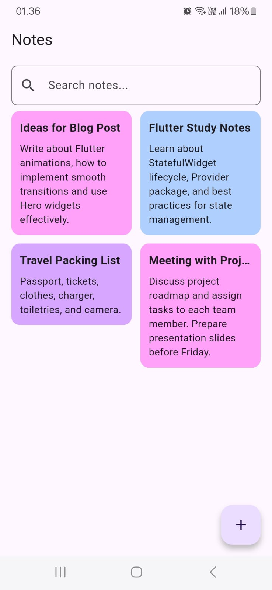
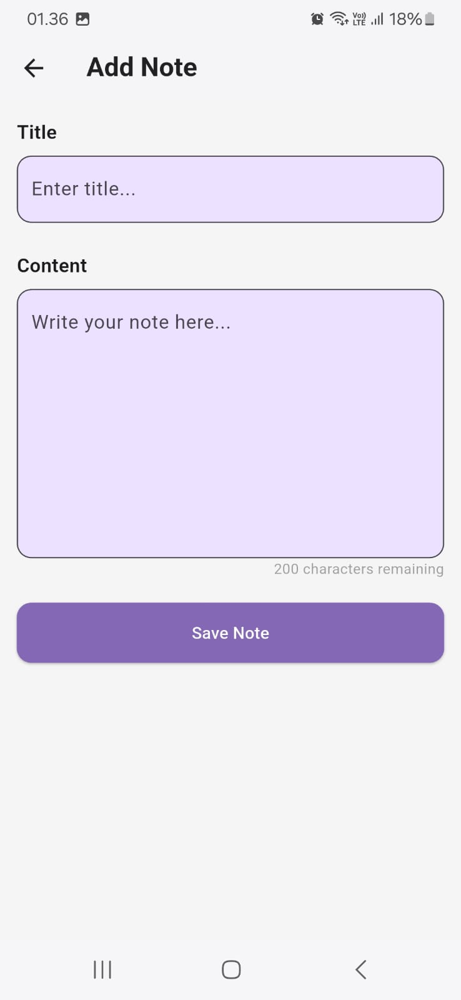
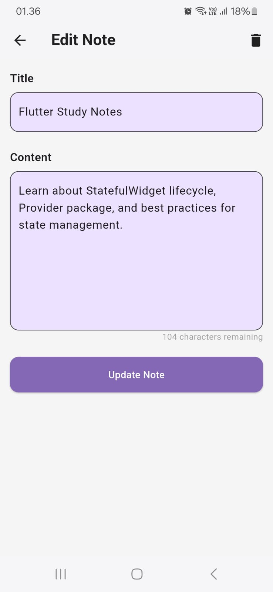
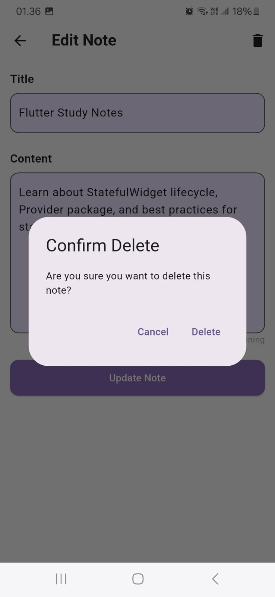
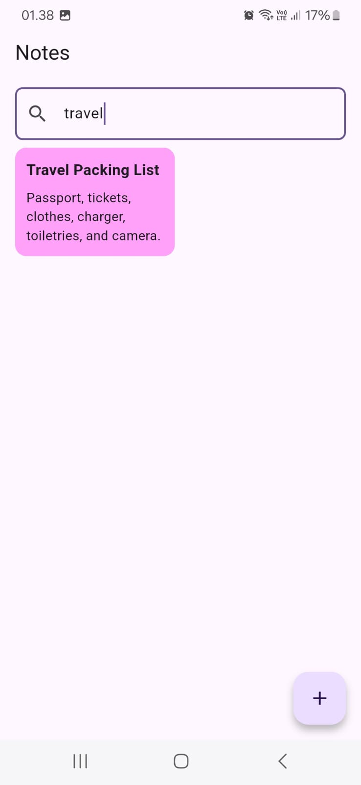

# 📝 Notes App (Flutter)

A simple and elegant Notes app built with **Flutter** using **Provider** for state management and **SQLite** for local storage. Users can add, edit, delete, and search notes with a beautiful staggered grid layout.

---

## 📸 Result Screenshots

<p float="left">
  
  
  
  
  
</p>

---

## ✨ Features

- ✅ Add, edit, and delete notes
- ✅ Search notes by keyword
- ✅ Persistent storage using SQLite
- ✅ Beautiful staggered grid view for note cards
- ✅ Unique ID for each note with UUID
- ✅ State management using Provider

---

## 🚀 Tech Stack

- [Flutter](https://flutter.dev/)
- [Provider](https://pub.dev/packages/provider)
- [Sqflite](https://pub.dev/packages/sqflite)
- [Path Provider](https://pub.dev/packages/path_provider)
- [UUID](https://pub.dev/packages/uuid)
- [Staggered Grid View](https://pub.dev/packages/flutter_staggered_grid_view)

---

## 📦 Dependencies

```yaml
dependencies:
  sqflite: ^2.4.2
  path_provider: ^2.1.5
  provider: ^6.1.5
  uuid: ^4.5.1
  flutter_staggered_grid_view: ^0.7.0
